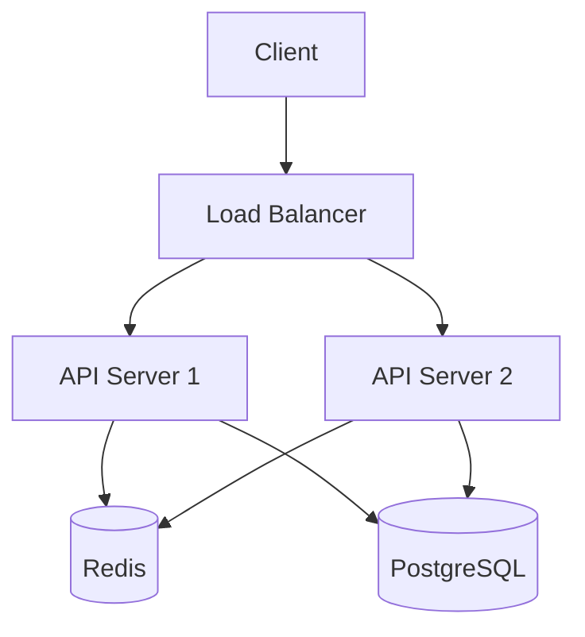

# Architecture Diagram

Generate system architecture diagrams. Choose format by context.

## Formats
- **Mermaid**: Markdown docs, GitHub README, version-controlled
- **Excalidraw**: Collaborative whiteboarding, rough sketches
- **ASCII art**: Terminal, CLI output, code comments

## Mermaid Pattern

## Rules
- Label every edge (what data flows?)
- Group by network boundary (public/private/internal)
- Max 12 nodes per diagram (split if larger)
- Always include legend for non-standard symbols
